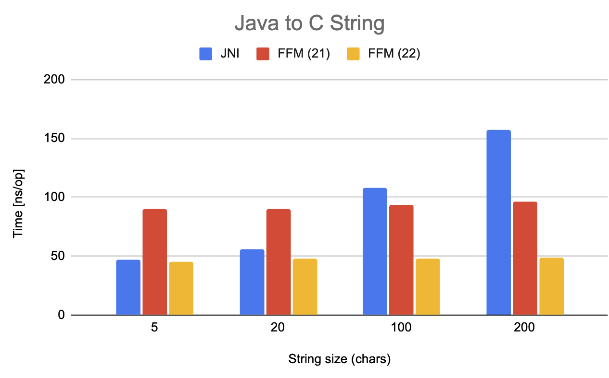

= Java 22: Panama FFM Provides Massive Performance Improvements for Strings

The Panama Foreign Function and Memory (FFM) API is slated to be finalized in Java 22 and will then be a part of the public Java API. One thing that is perhaps less known is the significant performance improvements made by FFM in certain areas in 22. In this short article we will be looking at _benchmarking string conversion_ in FFM for Java 21 and Java 22 compared to using old JNI calls.

== C and Java Strings

The Java Native Interface (JNI) has been used historically as a means to bridge Java to native calls before FFM was available. Both schemes entail converting strings back and forth between C and Java String data structures. As you might remember, C strings are just a bunch of bytes that are zero terminated whereas Java Strings are using a backing array with a known length.

When calling native function that takes one or more strings and/or returns a string (both are relatively common), the performance of converting strings back and forth becomes important.

== Benchmarks

We have run some string benchmarks (see https://github.com/openjdk/panama-foreign/pull/874/files[the source code here]) on a AMD Ryzen 9 3900X 12-Core Processor machine and preliminary results indicates blistering performance for FFM string conversion in Java 22:

[source,text]
----
Benchmark                           (size)  Mode  Cnt    Score   Error  Units
ToJavaStringTest.jni_readString          5  avgt   30   86.520 ? 1.842  ns/op
ToJavaStringTest.jni_readString         20  avgt   30   97.151 ? 1.459  ns/op
ToJavaStringTest.jni_readString        100  avgt   30  143.853 ? 1.287  ns/op
ToJavaStringTest.jni_readString        200  avgt   30  189.867 ? 2.337  ns/op
ToJavaStringTest.panama_readString       5  avgt   30   21.380 ? 0.351  ns/op
ToJavaStringTest.panama_readString      20  avgt   30   36.250 ? 0.520  ns/op
ToJavaStringTest.panama_readString     100  avgt   30   43.368 ? 0.544  ns/op
ToJavaStringTest.panama_readString     200  avgt   30   53.442 ? 2.048  ns/op

Benchmark                         (size)  Mode  Cnt    Score   Error  Units
ToCStringTest.jni_writeString          5  avgt   30   47.450 ? 0.832  ns/op
ToCStringTest.jni_writeString         20  avgt   30   56.208 ? 0.422  ns/op
ToCStringTest.jni_writeString        100  avgt   30  108.341 ? 0.459  ns/op
ToCStringTest.jni_writeString        200  avgt   30  157.119 ? 1.669  ns/op
ToCStringTest.panama_writeString       5  avgt   30   45.361 ? 0.717  ns/op
ToCStringTest.panama_writeString      20  avgt   30   47.742 ? 0.554  ns/op
ToCStringTest.panama_writeString     100  avgt   30   47.580 ? 0.673  ns/op
ToCStringTest.panama_writeString     200  avgt   30   49.060 ? 0.694  ns/op
----

Needless to say, the `ToJavaStringTest` runs are converting a C string to a Java string whereas the `ToCStringTest` runs convert a Java string to a C string. The `size` indicates the number of bytes of the original string. Java strings were coded in UTF-8.

As can be seen, we can expect FFM to convert C strings to Java strings more than *three times faster with FFM in Java 22*. In the other direction, performance will be about the same for small strings but for larger strings (where is matters more), the speedup factor will be ever-increasing. For example, for strings of length 200, the speedup factor is more than three times.

Note:: It should be noted that the benchmarks are not purely about string conversion as a JNI call also incurs a small state transition penalty for each call. The Java to C string performs a memory allocation (for the string bytes). While this could be avoided, it was included in the benchmark as that is what happens with JNI's `GetStringUTFChars`.

== Diagrams

Here are two diagrams outlining the performance benefits of FFM in comparison with JNI. The diagram also includes FFM in Java 21 to highlight the recent performance improvements made in 22.

_Diagram 1, shows the performance of converting a C string to a Java String._

_Diagram 2, shows the performance of converting a Java string to a C String._

== Future Improvements

FFM allows us to use custom allocators and so, if we make several calls, we can reuse memory segments thereby improving performance further. This is not possible with JNI.

It is also possible that we will see even better FFM performance in future Java versions once the Vector API becomes a final feature.

=== JDK Early-Access Builds

Run your own code on an early access JDK today by downloading a https://jdk.java.net[JDK Early-Access Build].

Note:: At the time of writing this article, the performance improvements are not merged in the Java 22 mainline yet. You can however build your own snapshot version with the performance improvements mentioned above by cloning https://github.com/openjdk/panama-foreign[github.com/openjdk/panama-foreign]

== Resources

* https://openjdk.org/jeps/434[JEP 442] Foreign Function & Memory API (Third Preview)
* https://openjdk.org/jeps/8310626[JEP draft: Foreign Function & Memory API (Final)]
* Open-Source Panama FFM on GitHub: https://github.com/openjdk/panama-foreign[github.com/openjdk/panama-foreign]

== Acknowledgments

This article were written by me (Per Minborg) and Maurizio Cimadamore.