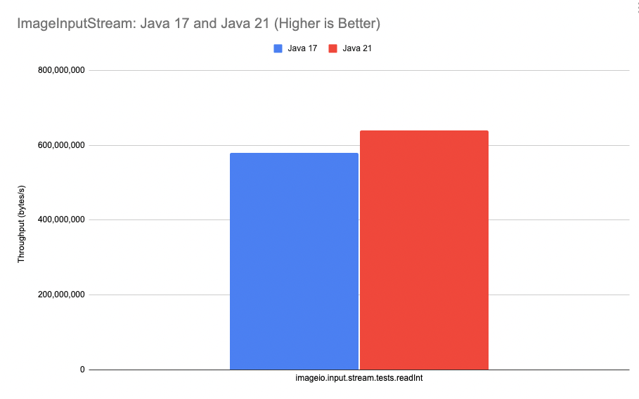

= JDK 21: Image Performance Improvements
Per Minborg
:toc:
:homepage: http://minborgsjavapot.blogspot.com/

== Introduction
In a link:../../January/26-PerformanceImprovementsRevealed/[previous article], I talked about how serialization and file I/O performance was improved in Java 21 thanks to the use of `VarHandle` constructs. The method employed there has now also been applied to Java’s image-handling library making it faster. Here is what happened:

== Background
When packing/unpacking primitive values (such as `int` and `long` primitives) into/from a byte array, conversion was previously made using explicit bit shifting as shown in the `ImageInputStreamImpl::readInt` method below:

[source,java]
----
public int readInt() throws IOException {
    if (read(byteBuf, 0, 4) !=  4) {
        throw new EOFException();
    }

    if (byteOrder == ByteOrder.BIG_ENDIAN) {
        return
            (((byteBuf[0] & 0xff) << 24) | ((byteBuf[1] & 0xff) << 16) |      // <1>
             ((byteBuf[2] & 0xff) <<  8) | ((byteBuf[3] & 0xff) <<  0));
    } else {
        return
            (((byteBuf[3] & 0xff) << 24) | ((byteBuf[2] & 0xff) << 16) |      // <2>
             ((byteBuf[1] & 0xff) <<  8) | ((byteBuf[0] & 0xff) <<  0));
    }
}
----

<1> Big-endian unpacking via bit shifting
<2> Little-endian unpacking via bit shifting

The scheme used here is similar to what is described in my link:../../January/26-PerformanceImprovementsRevealed/[previous article] so, I will not dive into the details again. In short, this method is complex and challenging for Java to fully optimize. Also, it is hard to read for us humans.

== Improvements in JDK 21
In Java 21, conversions are instead made with `VarHandle` constructs via the new `jdk.internal.util.ByteArray class`. Here is what parts of the internal `ByteArray` class look like:

[source,java]
----
private static final VarHandle INT =
        MethodHandles.byteArrayViewVarHandle(int[], ByteOrder.BIG_ENDIAN);

static int getInt(byte[] b, int off) {
    return (int) INT.get(b, off);
}
----

Using VarHandles means Java is able to optimize methods better compared to explicit bit shifting. Again, you can read more about link:../../January/26-PerformanceImprovementsRevealed/[how VarHandles work in my previous article].

The class above handles _big-endian_ and now there is also a new class that can pack/unpack values using _little-endian_ called `ByteArrayLittleEndian`. This means the `readInt()` method can be simplified and improved like this:

[source,java]
----
public int readInt() throws IOException {
    if (read(byteBuf, 0, 4) !=  4) {
        throw new EOFException();
    }

    return (byteOrder == ByteOrder.BIG_ENDIAN)
            ? ByteArray.getInt(byteBuf, 0)
            : ByteArrayLittleEndian.getInt(byteBuf, 0);
}
----

Nice! It looks much cleaner now.

== Affected Classes and Impact
The following classes were directly improved:

* `ImageInputStreamImpl`
* `ImageOutputStreamImpl`

The good news is that these classes provide the foundation for a large number of other image-handling classes in the `javax.imageio.stream` package and perhaps elsewhere (after all, the above classes are in the public API).

This means, in many cases, image handling becomes faster and all third-party libraries relying on any of the classes above (directly or indirectly) will also run faster with no change in your application code.

== Benchmarks
In the benchmarks below, I have used Java 17 as a baseline meaning that other Java 21 performance improvements will also contribute to higher performance. I have run the benchmarks using my Mac M1 aarch64 but the benchmarks are available https://github.com/openjdk/jdk/tree/master/src/demo/share/java2d/J2DBench[here for anyone to run].

_Graph 1 shows the performance of the `ImageInputStreamImpl::readInt` method for Java 17 and Java 21._

So, the throughput of the benchmarked method has improved from about 579,800,000 bytes/s to around 639,000,000 bytes/s on my machine which is more than a 10% improvement! Not too bad!

== Actual Application Performance Increase
How much faster will your image applications run under Java 21 in reality? There is only one way to find out: Run your own code on Java 21 today by downloading a https://jdk.java.net[JDK 21 Early-Access Build].

link:../../LICENSE[Copyright (c) 2023, Oracle and/or its affiliates.]