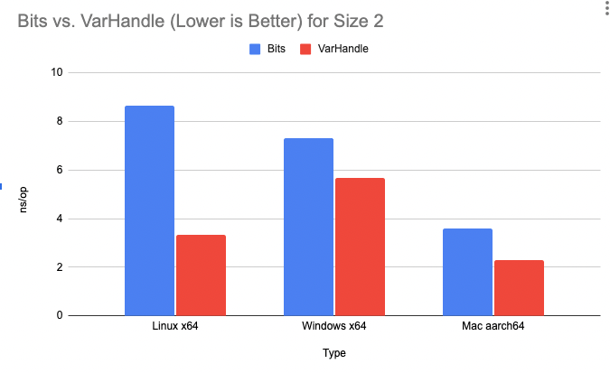
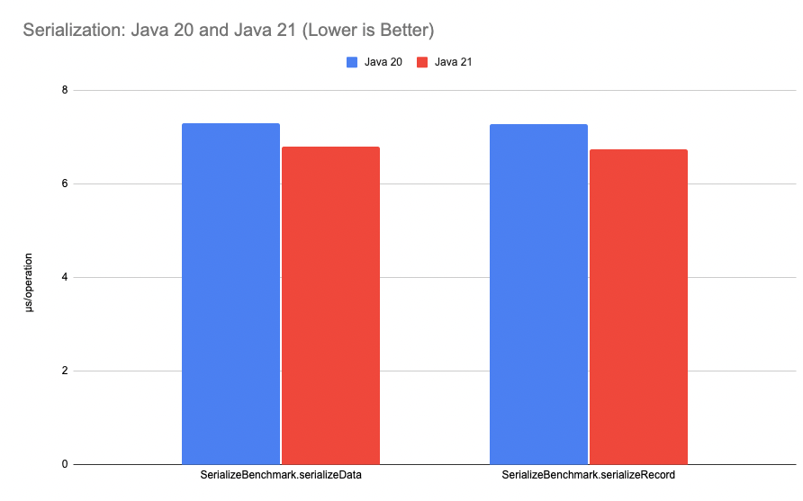

= Java 21: Image Performance Improvements
Per Minborg
:toc:
:homepage: http://minborgsjavapot.blogspot.com/

== Introduction
In Java 21, old code might run significantly faster due to recent internal performance optimizations made in the Java Core Libraries. In this article, we will take a closer look at some of these changes and see how much faster your favorite programming language has become. Buckle up, for we are about to run at full speed!

== Background
When converting primitive values such as int and long values back and forth to certain external representations, such as a file, the internal class `java.io.Bits` is used. In previous Java versions, conversion in this class was made using explicit bit shifting as shown hereunder:

[source, java]
----
static long getLong(byte[] b, int off) {
     return ((b[off + 7] & 0xFFL)      ) +
            ((b[off + 6] & 0xFFL) <<  8) +
            ((b[off + 5] & 0xFFL) << 16) +
            ((b[off + 4] & 0xFFL) << 24) +
            ((b[off + 3] & 0xFFL) << 32) +
            ((b[off + 2] & 0xFFL) << 40) +
            ((b[off + 1] & 0xFFL) << 48) +
            (((long) b[off])      << 56);
}
----

When taking a closer look, it can be seen that the code will extract a long from a backing byte array by successively extracting a byte value and left-shifting it various steps and then summing the bytes together.

As the lowest-index byte is the most significant (i.e. it is shifted to the left the most), extraction is made in _big-endian order_ (also called “_network order_”). There are eight similar steps in the algorithm, where each step is on a separate line, and each step comprises six sub-operations:

1. Add a constant to the provided off parameter
2. Extract a byte value at an index from the provided b array including checking index bounds
.onvert the byte value to a long (as an AND operation with another long on the LHS is imminent)
3. Perform an AND operation with the long value 0XFF
4. Shift the result to the left a number of steps
5. Accumulate the resulting value (via the + operation)
6. Hence, there are eight times six operations in total (= 48 operations) that need to be performed. In reality, Java is able to optimize these operations slightly, for example by leveraging CPU instructions that can perform several operations in a single step.

Calling `getLong()` from an outer loop entails checking index bounds many times as it is difficult to hoist boundary checking outside the outer loop due to the method’s complexity.

== Improvements in Java 21
In Java 21, conversions are made with VarHandle constructs instead and the class `java.io.Bits` was moved and renamed to `jdk.internal.util.ByteArray` so that other classes from various packages could benefit from it too. Here is what the `ByteArray::getLong` method looks like in Java 21:

[source, java]
----
private static final VarHandle LONG =
        MethodHandles.byteArrayViewVarHandle(long[], ByteOrder.BIG_ENDIAN);

static long getLong(byte[] b, int off) {
     return (long) LONG.get(b, off);
}
----

Here, It looks like only one operation is made. However, in reality, there are several things going on under the covers of the `VarHandle::get` operation. On platforms using _little-endian_ (which is almost 100% of the user base), the byte order needs to be swapped. Also, index bounds must be checked.

The cast `(long)` is needed in order to prevent auto-boxing/un-boxing for the return value of the `LONG` `VarHandle`. The inner workings of `VarHandle` objects and their coordinates are otherwise beyond the scope of this article.

As VarHandles are first-class citizens of the Java language, significant effort has been put into making them efficient. One can only assume the byte-swapping operations are optimized for the platform at hand. Also, the array bounds checking can be hoisted outside the many sub-steps so only one check is needed.

In addition to internal boundary-check hoisting, The `VarHandle` construct makes it easier for Java to further hoist boundary checks outside an outer loop compared to the older, more complex, implementation used in pre-Java 21.

Almost all methods in Bits/ByteArray got rewritten, not only `getLong()`. So, both reading and writing `short`, `int`, `float`, `long`, and, `double` values are now much faster.

== Affected Classes and Impact
The improved `java.util.ByteArray` class is used directly by the following Core Library classes:

* `ObjectInputStream`
* `ObjectOutputStream`
* `ObjectStreamClass`
* `RandomAccessFile`

Even though it appears the direct usage of `ByteArray` is limited, there is an enormous transitive use of these classes. For example, the three Object Stream classes above are used extensively in conjunction with serialization.

This means, in many cases, #Java serialization is much faster now#!

The `RandomAccessFile` class is used internally in the JDK for graphics and sound input/output as well as Zip and directory handling.

More importantly, there is a large number of third-party libraries that relies on these improved classes. They and all applications that are using them will automatically benefit from these improvements in speed. No change in your application code is needed. It just runs faster!

== Raw Benchmarks
The details of the first benchmarks shown hereunder are described in https://github.com/openjdk/panama-foreign/pull/762[this pull request]. The actual change of `Bits` was made via https://github.com/openjdk/jdk/pull/11840[this pull request].

I have run the benchmarks under Linux x64, Windows x64, and Max aarch64. Note that this implied running them on different hardware, so these results can’t be compared across operating systems. In other words, Mac aarch64 is not necessarily faster than Linux x64.

I’ve run the tests using the above `ByteArray::readLong` method, and I’ve used an outer loop with two iterations writing long values into an array. The more iterations in the outer loop, the more pronounced advantages we get with the VarHandle access. One reason for this is likely the C2 compiler is able to hoist out boundary checks outside the outer loop.

_Graph 1 shows the improvement in speed in Bits for various platforms._

== Serialization Benchmarks
So, given the performance increase in ByteArray looks awesome, what will be the practical effect on serialization given all the other things that need to happen during the serialization process?

Consider the following classes that contain all the primitive types (except boolean):

[source, java]
----
static final class MyData implements Serializable {

    byte b;
    char c;
    short s;
    int i;
    float f;
    long l;
    double d;

    public MyData(byte b, char c, short s, int i, float f, long l, double d) {
        this.b = b;
        this.c = c;
        this.s = s;
        this.i = i;
        this.f = f;
        this.l = l;
        this.d = d;
    }

}

record MyRecord(byte b,
                char c,
                shorts,
                int i,
                float f,
                long l,
                double d) implements Serializable {}
----

where the complete `PrimitiveFieldSerializationBenchmark` is https://github.com/openjdk/jdk/tree/master/test/micro/org/openjdk/bench/java/io[available here]. Running these benchmarks that serialize instances of the classes above on my laptop (macOS 12.6.1, MacBook Pro (16-inch, 2021) M1 Max) produced the following result:

[source, text]
----
-- Baseline (20-ea+30-2297)
Benchmark                           Mode  Cnt  Score   Error  Units
SerializeBenchmark.serializeData    avgt    8  7.283 ± 0.070  ns/op
SerializeBenchmark.serializeRecord  avgt    8  7.275 ± 0.201  ns/op

-- Java 21
Benchmark                           Mode  Cnt  Score   Error  Units
SerializeBenchmark.serializeData    avgt    8  6.793 ± 0.132  ns/op
SerializeBenchmark.serializeRecord  avgt    8  6.733 ± 0.032  ns/op
----

This is good news! Our classes now serialize more than 5% faster.

_Graph 2 shows the improvement in serialization for two classes._

== Future Improvements
There are several other classes in the JDK that look similar and that might benefit from the same type of performance improvements once they are optimized with VarHandle access.

*Caring for old code is a trait of good stewardship!*

== Actual Application Performance Increase
How much faster will your applications run under Java 21 in reality if you use one or more of these improved classes (directly or indirectly)? There is only one way to find out: Run your own code on Java 21 today by downloading a https://jdk.java.net[JDK 21 Early-Access Build].

link:../../LICENSE[Copyright (c) 2023, Oracle and/or its affiliates.]