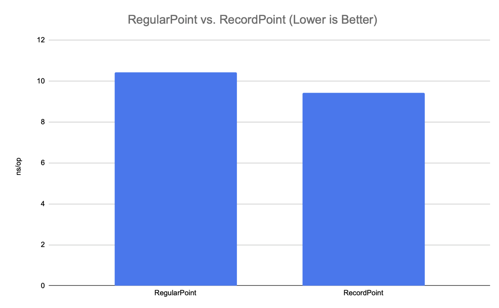

= Java Records are "Trusted" and Consequently Faster.

Did you know Java records are trusted by the Hotspot VM in a special way? This makes their speed superior in some aspects compared to regular Java classes. In this short article, we will take a look at constant folding of instance fields and how this can bolster the performance of your Java application.

== Background

Suppose we want to model an immutable point:

[source,java]
----
public interface Point {
    int x();
    int y();
}
----

Before record classes https://openjdk.org/jeps/395[were introduced] in Java, data classes had to be "manually" coded using a regular Java class like this:

[source,java]
----
public final class RegularPoint implements Point {

    private final int x;
    private final int y;

    public RegularPoint(int x, int y) {
        this.x = x;
        this.y = y;
    }

    @Override
    public int x() {
        return x;
    }

    @Override
    public int y() {
        return y;
    }

    // Implementations of toString(), hashCode() and equals()
    // omitted for brevity

}
----

With records, it became much easier and, we also got reasonable default implementations of the methods `toString()`, `hashCode()` and `equals()`:

[source,java]
----
public record RecordPoint(int x, int y) implements Point {}
----

As an extra bonus, there is an emerging property for records that makes them eligible for constant folding optimizations if used in a static context. Read more about this in the following chapters.

== Setup

Suppose we keep track of the special origin point in a `static` variable like this:

[source,java]
----
public static final Point ORIGIN = new RecordPoint(0, 0);
----

Further assume we have a method that determines if a given `Point` is at the origin point:

[source,java]
----
public static boolean isOrigin(Point point) {
        return point.x() == ORIGIN.x() &&
               point.y() == ORIGIN.y();
}
----

We could then write a small program that demos the principle:

[source,java]
----
public class Demo {

    public static final Point ORIGIN = new RecordPoint(0, 0);

    public static void main(String[] args) {
        analyze(new RegularPoint(0, 0));
        analyze(new RegularPoint(1, 1));
    }

    public static void analyze(Point point) {
        System.out.format("The point %s is %s at the origin.%n",
                point, isOrigin(point) ? "" : "not");
    }

    public static boolean isOrigin(Point point) {
        return point.x() == ORIGIN.x() &&
               point.y() == ORIGIN.y();
    }

}
----

When run, the code above will produce the following output:

[source,text]
----
The point RegularPoint{x=0, y=0} is at the origin.
The point RegularPoint{x=1, y=1} is not at the origin.
----

We could easily replace the use of `new RegularPoint(...)` with `new RecordPoint(...)` in the code above, and we would get a similar output:

[source,text]
----
The point RecordPoint[x=0, y=0] is at the origin.
The point RecordPoint[x=1, y=1] is not at the origin.
----

it appears the two implementation variants of the interface `Point` works as expected. But how is the performance of code affected by switching from regular Java classes to records?

== Benchmarks

Here is a benchmark that can be used to measure the effects of using records over regular classes:

[source, java]
----
@BenchmarkMode(Mode.AverageTime)
@OutputTimeUnit(TimeUnit.NANOSECONDS)
@State(Scope.Benchmark)
@Warmup(iterations = 5, time = 1)
@Measurement(iterations = 5, time = 1)
@Fork(value=3)
public class Bench {

    private static final RegularPoint REGULAR_ORIGIN = new RegularPoint(0, 0);
    private static final RecordPoint RECORD_ORIGIN = new RecordPoint(0, 0);

    private List<RegularPoint> regularPoints;
    private List<RecordPoint> recordPoints;

    @Setup
    public void setup() {
        regularPoints = IntStream.range(0, 16)
                .mapToObj(i -> new RegularPoint(i, i))
                .toList();

        recordPoints = IntStream.range(0, 16)
                .mapToObj(i -> new RecordPoint(i, i))
                .toList();
    }

    @Benchmark
    public void regular(Blackhole bh) {
        for (RegularPoint point: regularPoints) {
            if (point.x() == REGULAR_ORIGIN.x() && point.y() == REGULAR_ORIGIN.y()) {
                bh.consume(1);
            } else {
                bh.consume(0);
            }
        }
    }

    @Benchmark
    public void record(Blackhole bh) {
        for (RecordPoint point: recordPoints) {
            if (point.x() == RECORD_ORIGIN.x() && point.y() == RECORD_ORIGIN.y()) {
                bh.consume(1);
            } else {
                bh.consume(0);
            }
        }
    }

    public static void main(String[] args) throws Exception {
        org.openjdk.jmh.Main.main(args);
    }

}
----

When run on a Mac M1 laptop, the following results emerged (lower is better):

[source, text]
----
Benchmark      Mode  Cnt   Score   Error  Units
Bench.regular  avgt   15  10.424 ± 0.257  ns/op
Bench.record   avgt   15   9.412 ± 0.181  ns/op
----

As can be seen, records are about 10% faster than regular classes in this benchmark.

Here is how it looks like in a graph:

_Graph 1, shows the performance of regular and record classes._

== Under the Hood

Looking at why records can be faster in cases like the above, there is a clue in the class https://github.com/openjdk/jdk/blob/master/src/hotspot/share/ci/ciField.cpp#L240[ciField.cpp] which tells the Hotspot compiler which instance fields should be "trusted" when performing constant folding. The class also gives away some clues of other Java classes that benefit from the same optimizations. One example is the https://openjdk.org/jeps/454[Foreign Function & Memory API] that is slated to be finalized in Java 22 and where, for example, all classes implementing the various `MemoryLayout` variants all are eligible for constant folding optimizations.

The C++ class above is not available to regular Java programs but, by switching to records, we may directly reap the benefits of constant folding for instance fields.

As a final note, it should be said that modifying records fields (which are `private` and `final`) using, for example, `Usafe` is ... well ... unsafe and would produce an undefined result. Don't do that!

== Conclusion

Records offer a convenient way of expressing data carriers. As an added benefit, they also provide improved performance compared to regular Java classes in some applications.