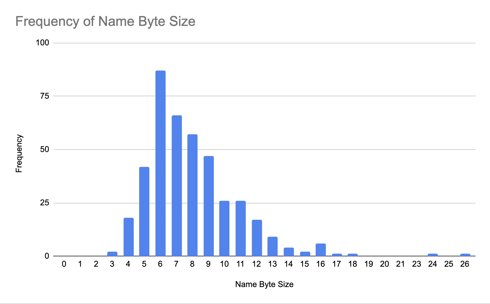
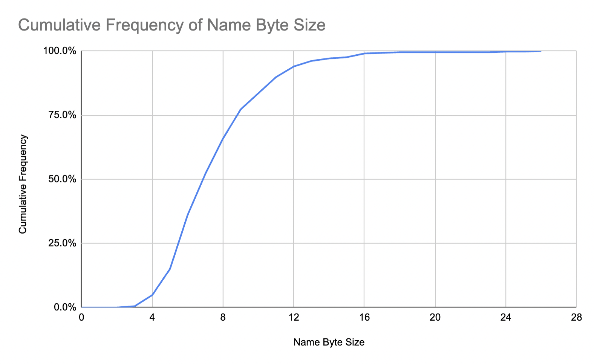
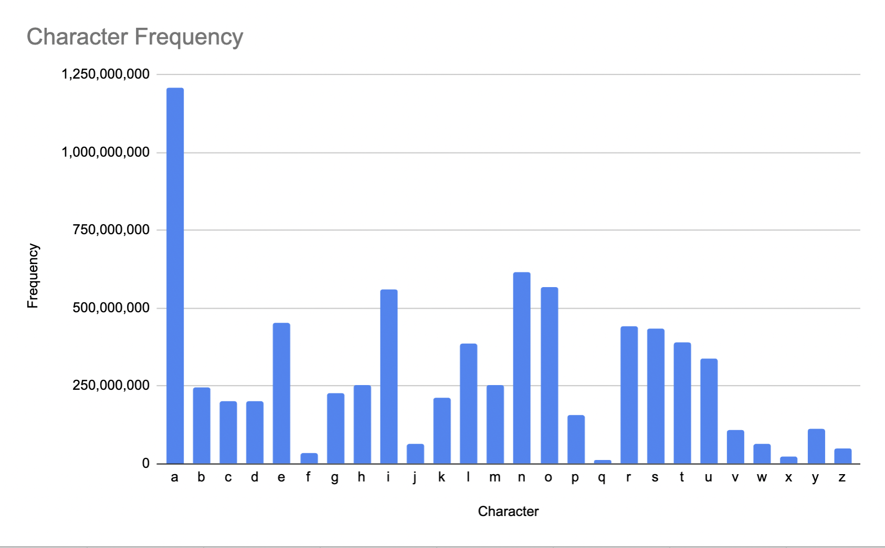
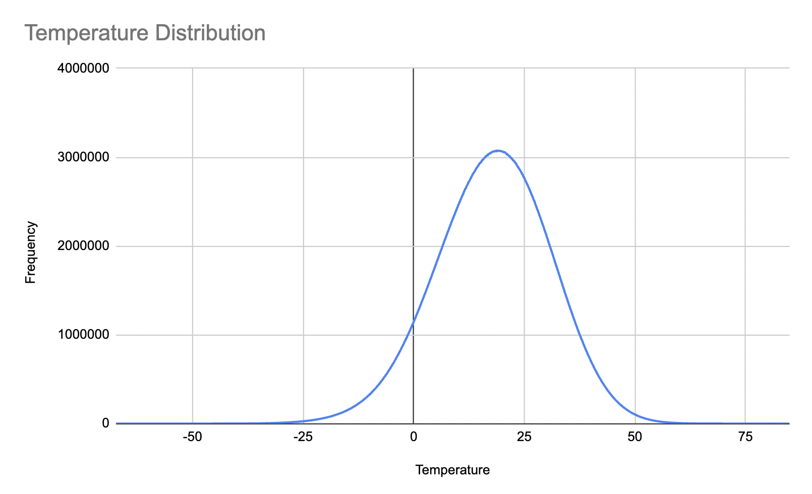

= Statistics for the 1BRC
Per Minborg
:toc:
:homepage: http://minborgsjavapot.blogspot.com/

== Introduction
It is hard to avoid hearing about link:https://github.com/gunnarmorling/1brc[Gunnar Morling's "One Billion Row Challenge"] these days, where the objective is to parse and compute the min, average and max value for various weather stations using the Java language. The data to analyze is a semicolon separated list of rows that looks like this:

[source]
----
Hamburg;12.0
Bulawayo;8.9
Palembang;38.8
St. John's;15.2
Cracow;12.6
Bridgetown;26.9
Istanbul;6.2
Roseau;34.4
Conakry;31.2
Istanbul;23.0
----

As indicated by the name of the project, there are one billion such rows. I have struggled for several weeks *not* to enter the competition.

Anyway, I suspect there are some gains to be harvested if one knows the distribution of the values in the generated `measurement.txt` file of size 13 GiB (hereafter called "the file") and in this short article, I want to share my findings.

== Name Statistics

The names are UTF-8 coded and can occupy up 100 bytes of space.

Looking at the file, one can conclude that there are *413 distinct names*. So, the number of stations is actually relatively limited. Holding these in hash tables or the likes is not anticipated to take up a significant amount of memory.

=== Length

Taking a look at the distribution of the byte length (as opposed to the UTF-8 length) of the various names (if decoded by `String::getBytes`), we can see the following,

[cols="1,1"]
|===
|Size|Frequency

|3 |2
|4| 18
|5| 42
|6| 87
|7| 66
|8| 57
|9| 47
|10| 26
|11| 26
|12| 17
|13| 9
|14| 4
|15| 2
|16| 6
|17| 1
|18| 1
|24| 1
|26| 1
|===

Here is what a frequency chart with the above figures looks like:

_Chart 1, Showing the frequency of various name byte sizes._

The corresponding cumulative frequency chars looks like this:

_Chart 2, Showing the cumulative frequency of various name byte sizes._

As can be seen, considering only the first 16 bytes will cover more than 99% of the names in the file.

=== Appearance

The number of times a station appears in the file very similar ranging from "Roseau" with 2,417,155 to "Chihuahua" with 2,425,899 appearances.

=== Characters

Character values can (but does not have to) be stored as
link:https://www.asciitable.com/[ASCII-values].

Taking a closer look at the actual characters making up the names using binary encoded values, we can see the following:

[cols="1,1,1"]
|===
|Value|Char|Frequency

|0..32||0
|32|[space]| 181605826
|33|| 0
|34|| 0
|35|| 0
|36|| 0
|37|| 0
|38|| 0
|39|'| 12104970
|40|(| 2422734
|41|)| 2422734
|42|*| 0
|43|+| 0
|44|,| 4845007
|45|-| 14533546
|46|.| 9686377
|47|/| 0
|48|0| 0
|49|1| 0
|50|2| 0
|51|3| 0
|52|4| 0
|53|5| 0
|54|6| 0
|55|7| 0
|56|8| 0
|57|9| 0
|58|| 0
|59|| 0
|60|| 0
|61|| 0
|62|| 0
|63|| 0
|64|| 0
|65|A| 82,312,102
|66|B| 99,268,251
|67|C| 94,430,447
|68|D| 70,215,892
|69|E| 14,526,993
|70|F| 16,957,547
|71|G| 33,899,137
|72|H| 50,855,379
|73|I| 12,102,959
|74|J| 26,634,842
|75|K| 53,262,607
|76|L| 72,646,247
|77|M| 99,292,126
|78|N| 55,695,661
|79|O| 31,475,791
|80|P| 79,892,902
|81|Q| 0
|82|R| 29,051,519
|83|S| 99,282,847
|84|T| 72,636,263
|85|U| 4,842,032
|86|V| 33,897,984
|87|W| 21,796,354
|88|X| 2,421,477
|89|Y| 19,373,396
|90|Z| 7,262,683
|91|[| 0
|92|[back slash]| 0
|93|]| 0
|94|^| 0
|95|_| 0
|96|`| 0
|97|a| 1,125,887,562
|98|b| 147,711,179
|99|c| 106,528,787
|100|d| 130,753,955
|101|e| 438,247,893
|102|f| 16,946,953
|103|g| 191,298,907
|104|h| 200,950,920
|105|i| 547,230,962
|106|j| 38,740,836
|107|k| 157,372,493
|108|l| 314,764,906
|109|m| 154,957,248
|110|n| 559,330,103
|111|o| 535,145,324
|112|p| 77,480,229
|113|q| 12,101,467
|114|r| 411,634,242
|115|s| 336,573,182
|116|t| 317,179,382
|117|u| 334,155,534
|118|v| 72,645,180
|119|w| 43,579,677
|120|x| 19,362,397
|121|y| 92,009,532
|122|z| 43,584,786
|123|{| 0
|124|[bar]| 0
|125|}| 0
|126|~| 0
|127|[del]| 0
|128|| 0
|129|| 0
|130|| 4842294
|131|| 2422260
|132..152|| 0
|153|| 2422260
|154|| 0
|155|| 0
|156|| 2420126
|157|| 0
|158|| 0
|159|| 0
|160|| 0
|161|| 0
|162|| 0
|163|| 0
|164|| 0
|165|| 0
|166|| 0
|167|| 0
|168|| 4843781
|169|| 29054839
|170|| 0
|171|| 0
|172|| 0
|173|| 2422053
|174|| 0
|175|| 0
|176|| 2421256
|177|| 0
|178|| 0
|179|| 0
|180|| 0
|181|| 0
|182|| 0
|183|| 0
|184|| 2421983
|185|| 0
|186|| 0
|187|| 0
|188|| 4840135
|189|| 0
|190|| 0
|191|| 0
|192|| 0
|193|| 0
|194|| 0
|195|| 46002917
|196|| 4843516
|197|| 4842294
|198|| 0
|199|| 0
|200|| 2422260
|201...256||0

|===

Just considering characters a..z and not considering casing, we get the following table:

[cols="1,1"]
|===
|Char|Frequency

|a|	1,208,199,664
|b|	246,979,430
|c|	200,959,234
|d|	200,969,847
|e|	452,774,886
|f|	33,904,500
|g|	225,198,044
|h|	251,806,299
|i|	559,333,921
|j|	65,375,678
|k|	210,635,100
|l|	387,411,153
|m|	254,249,374
|n|	615,025,764
|o|	566,621,115
|p|	157,373,131
|q|	12,101,467
|r|	440,685,761
|s|	435,856,029
|t|	389,815,645
|u|	338,997,566
|v|	106,543,164
|w|	65,376,031
|x|	21,783,874
|y|	111,382,928
|z|	50,847,469
|===

Here is what a frequency chart with the above figures looks like:

_Chart 3, shows a character frequency table._

== Temperature Statistics

The temperatures appear in the interval [-67.3, 84.9] and have the following distribution:

_Chart 4, shows the temperature distribution._

I hope this can spark some ideas in the community. Good luck with your challenge entry!

link:../../LICENSE[Copyright (c) 2023, Oracle and/or its affiliates.]