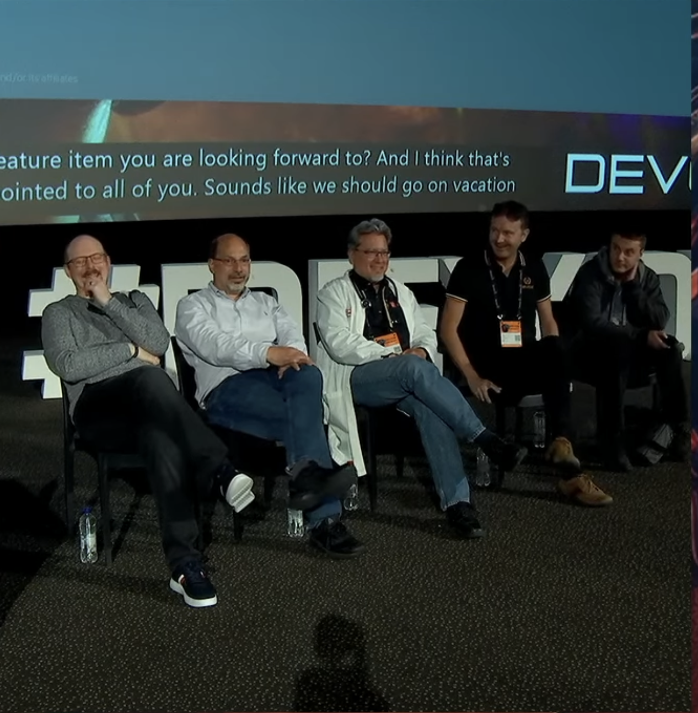

= Java Articles, by Per Minborg

== About Me

[cols="1,1", frame=none, grid=none]
|===
| I am a Java Core Library developer at Oracle and here are some of my articles about the inner workings of Java. The views on this blog are my own and are not necessarily the ones of Oracle, Inc.

Happy Reading! /Per Minborg | image:images/per-brighter.png[alt=Golden Gate,scaledwidth=50%, role="related thumb left"]
|===

== Articles 2023

=== link:2024/15-StatisticsFor1brc/[Statistics for the 1BRC] (2024-Jan-15)

How data is distributed in link:https://github.com/gunnarmorling/1brc[Gunnar Morling's "One Billion Row Challenge"]. Know your data and get better performance.

== Articles 2023

=== Presentations at Devoxx BE October 2023

I did two presentations at Devoxx and also participated in the "Ask the Java Architects" presentation.

Here are the videos of the presentations:

link:https://youtu.be/DlTUMjg7DD0[Ask the Java Architects] By Sharat Chander, Alan Bateman, Stuart Marks, Viktor Klang, Brian Goetz, and Per Minborg

link:https://youtu.be/T6X2Yytrzyg[With Java 21, Your Code Runs Even Faster But How is That Possible?] By Per Minborg

link:https://youtu.be/t8c1Q2wJOoM[The Panama Dojo: Black Belt Programming with Java 21 and the FFM API] by Per Minborg

Here is the code I used in my presentations:

link:2023/October/2-Devoxx-Performance/[Code: With Java 21, Your Code Runs Even Faster But How is That Possible?]

link:2023/October/5-Devoxx-PanamaDojo/[Code: The Panama Dojo: Black Belt Programming with Java 21 and the FFM API]

Thanks to all who provided feedback and those who attended
the presentations. See you next year!

=== link:2023/September/14-Trusted-Records/README.adoc[Java Records are "Trusted" and Consequently Faster] (2023-Sep-14)

Did you know Java records are trusted by the Hotspot VM in a special way? This makes their speed superior in some aspects compared to regular Java classes. In this short article, we will take a look at _constant folding of instance fields_ and how this can bolster the performance of your Java application.

=== link:2023/August/25-Panama-String-Performance/README.adoc[Java 22: Panama FFM Provides Massive Performance Improvements for Strings] (2023-Aug-25)

The Panama Foreign Function and Memory (FFM) API is slated to be finalized in Java 22 and will then be a part of the public Java API. One thing that is perhaps less known is the significant performance improvements made by FFM in certain areas in 22. In this short article we will be looking at _benchmarking string conversion_ in FFM for Java 21 and Java 22 compared to using old JNI calls.

=== link:2023/August/2-Computed-Constants/README.adoc[Java: JEP Draft: "Computed Constants"] (2023-Aug-2)

The draft JEP "Computed Constants" went public. `ComputedConstant` objects are superfast immutable value holders that can be initialized independently of when they are created. As an added benefit, these objects may in the future be even more optimized via "condensers" that eventually might become available through project Leyden.

=== link:2023/February/13-ImagePerformanceImprovements/README.adoc[JDK 21: Image Performance Improvements] (2023-Feb-13)

In a link:2023/January/26-PerformanceImprovementsRevealed/[previous article], I talked about how serialization and file I/O performance was improved in Java 21 thanks to the use of `VarHandle` constructs. The method employed there has now also been applied to Java’s image-handling library making it faster. Here is what happened.

=== link:2023/February/7-jFocus2023/README.adoc[jFocus 2023 Presentation: Panama Foreign Function and Memory API] (2023-Feb-7)
The Panama FFM API previewed for a second time in JDK 20. In this article, we will see how to make use of the new APIs and how to call native functions in a native library. This article summarized key points made at https://www.jfokus.se[jFocus 2023 in Stockholm].

=== link:2023/January/26-PerformanceImprovementsRevealed/README.adoc[JDK 21: Performance Improvements Revealed] (2023-Jan-26)
_In Java 21, old code might run significantly faster due to recent internal performance optimizations made in the Java Core Libraries. In this article, we will take a closer look at some of these changes and see how much faster your favorite programming language has become. Buckle up, for we are about to run at full speed!

== Safe Harbor Statement
The following is intended to outline our general product direction. It is intended
for information purposes only, and may not be incorporated into any contract. It is not a commitment to deliver any material, code, or functionality, and should not be relied upon in making purchasing decisions. The development, release, timing, and pricing of any features or functionality described for Oracle’s products may change and remains at the sole discretion of Oracle Corporation.

== Copyright Notice
link:LICENSE[Copyright (c) 2023, Oracle and/or its affiliates.]